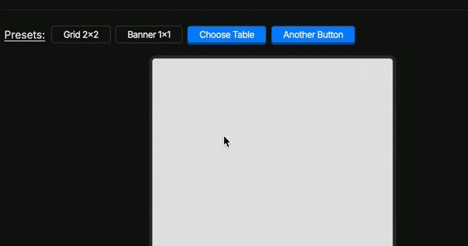

Jquery Grid Picker
==================

This is a jQuery plugin that allows you to get a grid size interactively.

Here is a preview of the plugin in action:



## Usage

```html
<link rel="stylesheet" href="css/jquery-grid-picker.css">
<script src="js/jquery-grid-picker.js"></script>
<button class="grid-picker-button">Pick a grid size</button>
```
